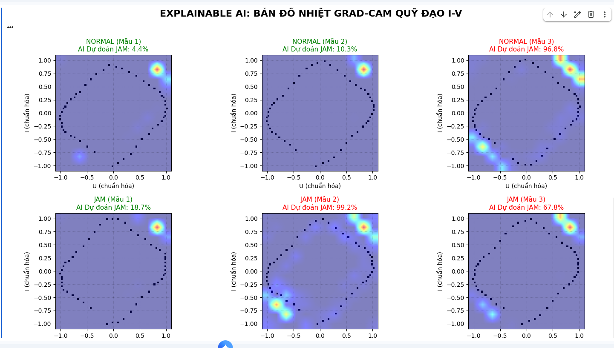

# Toi Uu Sieu Tham So Cho Mo Hinh CNN Phat Hien JAM

Du an nay toi uu sieu tham so bang Optuna cho bai toan phan loai `NORMAL` va `JAM` tu du lieu song dien ap/dong dien dang CSV. Quy trinh chinh:

1. Doc du lieu CSV va cat theo chu ky song.
2. Chuan hoa va chuyen cac cua so chu ky thanh anh 2D histogram (U-I trajectory heatmap).
3. Dung Optuna + KFold de tim bo sieu tham so tot nhat cho CNN.
4. Lay so epoch toi uu tu ket qua early stopping trong qua trinh CV.
5. Train final model tren toan bo tap train/validation va danh gia tren test.

## Cau truc tep quan trong

- `Filetoiuuthamso.py`: Script chinh de tien xu ly, toi uu, huan luyen va danh gia.
- `image-1.png`: Anh minh hoa ket qua.

## Yeu cau moi truong

Khuyen nghi Python 3.9 - 3.11.

Can cai cac thu vien:

- tensorflow
- pandas
- numpy
- scikit-learn
- optuna

Co the cai nhanh bang lenh:

```bash
pip install tensorflow pandas numpy scikit-learn optuna
```

## Dinh dang du lieu dau vao

Moi file CSV can co cac cot sau (mot trong 2 ten cho moi truong hop):

- Cot trang thai: `Event` hoac `EVENT`
- Cot dien ap: `Uwave` hoac `Voltage[V]`
- Cot dong dien: `Iwave` hoac `Current[A]`

Script se tim diem qua zero cua dien ap de cat chu ky, noi suy ve so diem co dinh (mac dinh 50 diem/chu ky), roi tao anh 2D histogram kich thuoc `64 x 64`.

## Thu muc du lieu can nhap

Khi chay script, ban se nhap 3 duong dan:

- Thu muc TRAIN (vi du 14 file)
- Thu muc VALIDATION (vi du 2 file)
- Thu muc TEST (vi du 4 file)

Luu y: Script gop TRAIN + VALIDATION thanh mot tap cho toi uu Optuna/KFold. TEST duoc giu rieng de bao cao ket qua cuoi.

## Cach chay

```bash
python Filetoiuuthamso.py
```

Sau do nhap duong dan cac thu muc du lieu theo huong dan tren man hinh.

## Cac buoc xu ly trong script

1. Co dinh seed de tang tinh tai lap (`set_global_determinism`).
2. Tien tai du lieu 1D vao RAM de tang toc cho Optuna.
3. Dung Optuna (20 trials) tim:
   - `window_size`
   - `overlap`
   - `conv1`, `conv2`, `conv3`
   - `dense`, `dropout`, `lr`
4. Danh gia moi trial bang KFold 3 nhanh va metric F1.
5. Luu epoch toi uu trung binh tu early stopping cua trial tot nhat.
6. Huan luyen final model voi bo tham so va so epoch toi uu.
7. In `classification_report` tren tap test (`NORMAL`, `JAM`).

## Dau ra

Script se in:

- Bo sieu tham so toi uu
- So epoch toi uu
- Bao cao phan loai tren tap test

## Minh hoa



## Ghi chu

- Neu thu muc co file loi dinh dang, script bo qua file do (try/except trong qua trinh doc).
- Ban co the tang `n_trials` trong Optuna de tim kiem rong hon, doi lai thoi gian chay se tang.